## Инструмент ipcalc. Part 1.
-   **1.1. Сети и маски**
    1) Адрес сети 192.167.38.54/13:
        * **Команда:** `ipcalc 192.167.38.54/13`
        * **Результат:**
        * 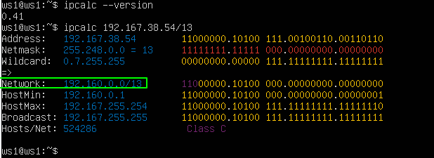
        * **Используя ipcalc — адрес сети:** `192.160.0.0`
    2)  Перевод масок:
        * `255.255.255.0`: префиксная `/24`, двоичная `11111111.11111111.11111111.00000000`
        * `/15`: обычная `255.254.0.0`, двоичная `11111111.11111110.00000000.00000000`
        * `11111111.11111111.11111111.11110000`: обычная `255.255.255.240`, префиксная `/28`

    3)  Минимальный и максимальный хост в сети 12.167.38.4 при масках:
        | Маска | Минимальный хост | Максимальный хост |
        |-------|------------------|-------------------|
        | `/8` | `12.0.0.1` | `12.255.255.254` |
        | `255.255.0.0` (двоичная: `11111111.11111111.00000000.00000000`) | `12.167.0.1` | `12.167.255.254` |
        | `255.255.254.0` | `12.167.38.1` | `12.167.39.254` |
        | `/4` | `0.0.0.1` | `15.255.255.254` |
        * 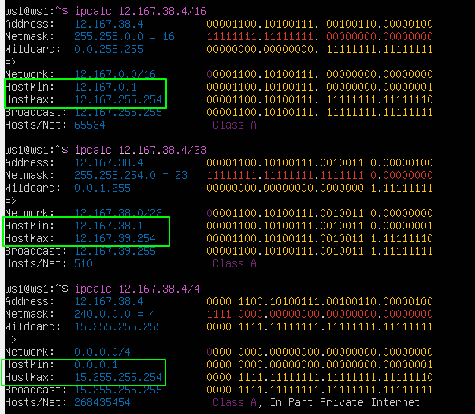

-   **1.2. localhost**
        * **localhost- Это специальное зарезервированное имя, которое всегда указывает на "самого себя". Его IP-адрес — 127.0.0.1.**
        * **Обращение к приложению на localhost возможно с IP:**
        * `194.34.23.100` — **нет, не относится к 127.0.0.0/8.**
        * `127.0.0.2` — **да, относится к 127.0.0.0/8.**
        * `127.1.0.1` — **да, относится к 127.0.0.0/8.**
        * `128.0.0.1` — **нет, не относится к 127.0.0.0/8.**

-   **1.3. Диапазоны и сегменты сетей**
        1)  **Публичные IP:** `134.43.0.2`, `192.172.0.1`, `172.68.0.2`, `192.169.168.1`
        2)  **Частные IP: Зарезервированы для локальных сетей.** `10.0.0.45`, `192.168.4.2`, `172.20.250.4`, `172.0.2.1` (частично), `172.16.255.255`, `10.10.10.10`
        3)  **Возможные IP-адреса шлюза у сети 10.10.0.0/18:** `10.10.0.2`, `10.10.10.10`, `10.10.1.255`.
        4)  **Невозможные:** `10.0.0.1`, `10.10.100.1`

## Part 2. Статическая маршрутизация между двумя машинами
#### Подняла две виртуальные машины (далее -- ws1 и ws2).
#### С помощью команды ip a посмотрела существующие сетевые интерфейсы на ws1:

#### Описала сетевой интерфейс, соответствующий внутренней сети, на обеих машинах и задала следующие адреса и маски: ws1 — 192.168.100.10, маска /16, ws2 — 172.24.116.8, маска /12:
    Сетевой интерфейс, соответствующий внутренней сети, это интерфейс, который подключен к локальной сети внутри организации или домашней сети и предназначен для обмена данными между устройствами в этой сети. Обычно такие интерфейсы имеют адреса из частных IP-диапазонов, например, 192.168.x.x, 172.16.x.x - 172.31.x.x или 10.x.x.x.
    В сетевых настройках такой интерфейс может быть настроен для использования DHCP, если адреса присваиваются автоматически, или для использования статических IP-адресов, если адреса присваиваются вручную. Также могут быть настроены другие параметры, такие как маска подсети, шлюз по умолчанию и DNS-серверы.

    Кроме того, внутренний интерфейс может иметь дополнительные параметры безопасности, такие как настройки брандмауэра, чтобы защитить локальную сеть от внешних угроз.
**Для открытия файлы конфигурации сетевых интерфейсов использовала команду:**
    `sudo nano /etc/netplan/00-installer-config.yaml`

**Для сохранения внесенных изменений вфайлы конфигурации сетевых интерфейсов использовала команду:**

`sudo netplan apply`
`Если конфигурация указана верно, на выходе не должно быть никаких ошибок`

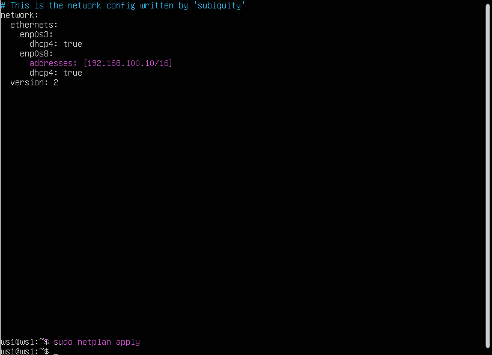
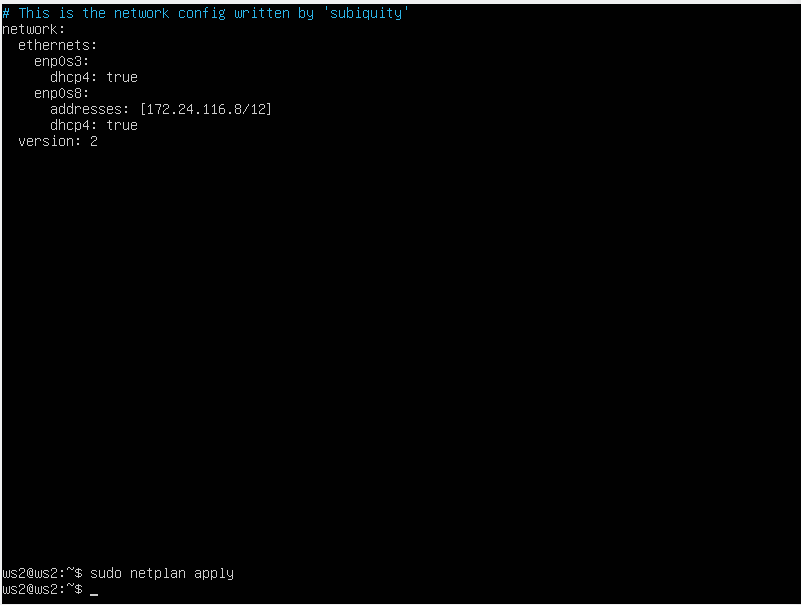

**Вывод после команды netplan apply пустой- значит, ошибок нет**

#### Добавление статического маршрута вручную.
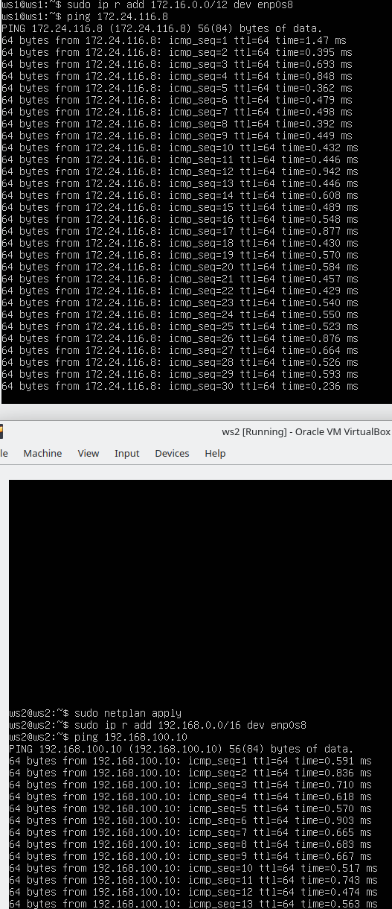
#### Пропинговала соединение между машинами.
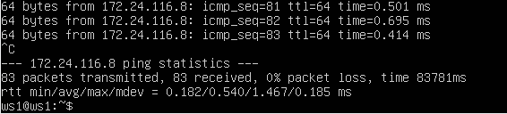
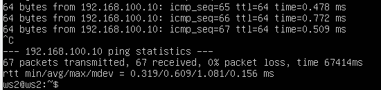
#### Добавление статического маршрута с сохранением.
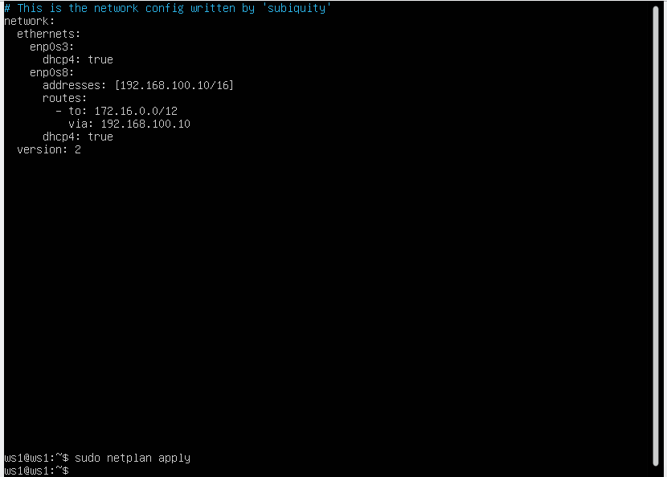
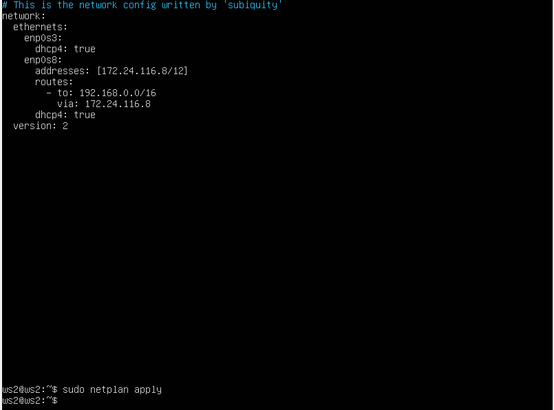
#### Пропинговала соединение между машинами.
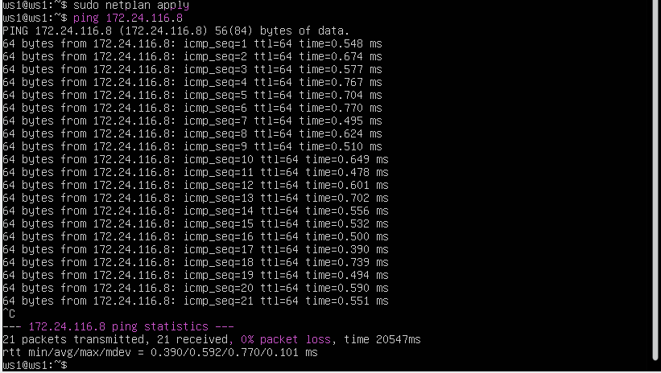
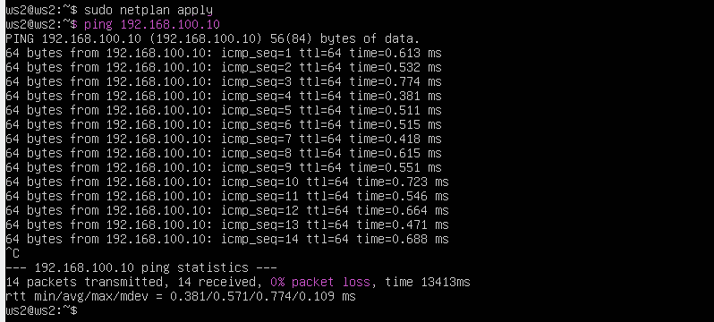

## Part 3. Утилита iperf3
#### 3.1. Скорость соединения.
-   **3.1. Скорость соединения**
    1)  8 Mbps в MB/s:
        * **Расчёт:** 8 Мбит/с ÷ 8 бит/байт = 1 МБ/с
        * **Ответ:** 1 MB/s
    2)  100 MB/s в Kbps:
        * **Расчёт:** 100 МБ/с × 1024 КБ/МБ × 8 бит/байт = 819200 Кбит/с
        * **Ответ:** 819200 Kbps
    3)  1 Gbps в Mbps:
        * **Расчёт:** 1 Гбит/с × 1000 Мбит/Гбит = 1000 Мбит/с
        * **Ответ:** 1000 Mbps
#### 3.2 Измерила скорость соединения между ws1 и ws2.
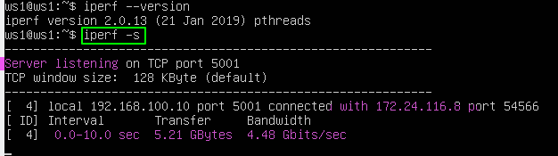
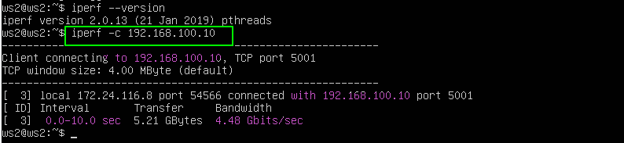

## Part 4. Сетевой экран.
#### 4.1. Утилита iptables.
**Требования по заданию такие: Нужно было добавить в файл подряд следующие правила:**

    1) На ws1 применила стратегию, когда в начале пишется запрещающее правило, а в конце пишется разрешающее правило (это касается пунктов 4 и 5).
    2) На ws2 применила стратегию, когда в начале пишется разрешающее правило, а в конце пишется запрещающее правило (это касается пунктов 4 и 5).
    3) Открыла на машинах доступ для порта 22 (ssh) и порта 80 (http).
    4) Запретила echo reply (машина не должна «пинговаться», т. е. должна быть блокировка на OUTPUT).
    5) Разрешила echo reply (машина должна «пинговаться»)(!).

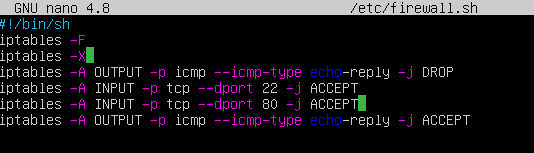
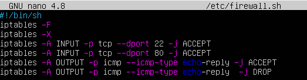
#### 4.1 Запустила файлы на обеих машинах командами chmod +x /etc/firewall.sh и /etc/firewall.sh:
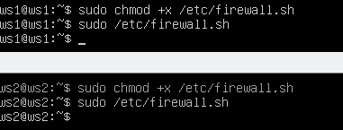

**Описание разницы между стратегиями фаервола**
**Стратегия на `ws1` (запрет в начале):**
        **На `ws1` была использована стратегия, где запрещающее правило (`DROP`) было расположено перед разрешающим (`ACCEPT`). В файле `/etc/firewall.sh` это правило блокирует исходящие ICMP-пакеты с типом `echo-reply`. Поскольку правила обрабатываются последовательно сверху вниз, `DROP` сработает раньше, чем `ACCEPT`. Следовательно, `ws1` не будет отвечать на пинги.**
**Стратегия на `ws2` (разрешение в начале):**
        **На `ws2` былв применена обратная стратегия: разрешающее правило (`ACCEPT`) стоит перед запрещающим (`DROP`). `iptables` обрабатывает правила по порядку. Если пакет соответствует правилу `ACCEPT`, он будет пропущен и обработка цепочки прекратится, не дойдя до правила `DROP`. Таким образом, `ws2` будет отвечать на пинги, так как правило, разрешающее `echo-reply`, срабатывает раньше.**

#### 4.2 Утилита nmap.
#### Командой ping нашла машину, которая не «пингуется», после чего утилитой nmap показала, что хост машины запущен.
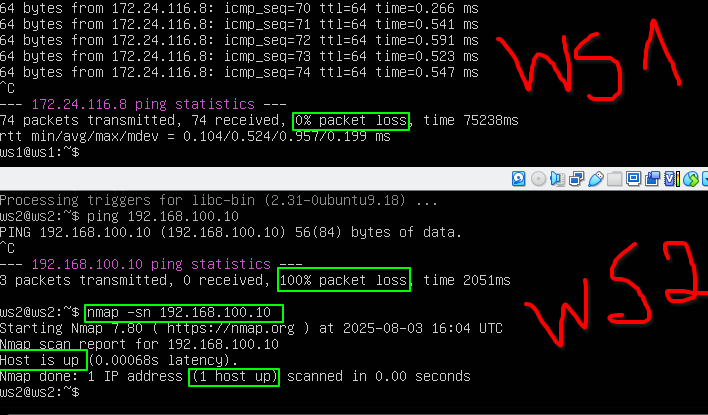
#### (Проверка: в выводе nmap должно быть сказано: Host is up.)

------------------------------------------
## Part 5. Статическая маршрутизация сети!
#### Подняла пять виртуальных машин (3 рабочие станции (ws11, ws21, ws22) и 2 роутера (r1, r2)).
#### 5.1. Настройка адресов машин.

#### Настроила конфигурации машин в etc/netplan/00-installer-config.yaml согласно сети на рисунке.
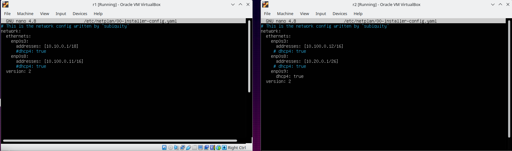
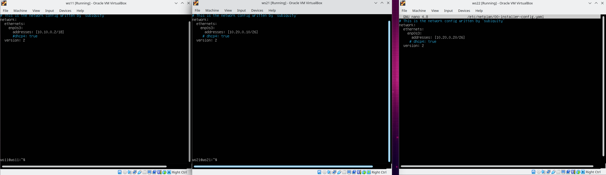
#### Перезапустила  сервис сети. Ошибок нет, командой ip -4 a проверила, что адрес машины задан верно. Также пропинговала ws22 с ws21:
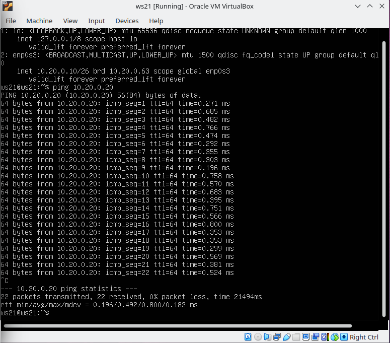
#### Аналогично r1 с ws11:
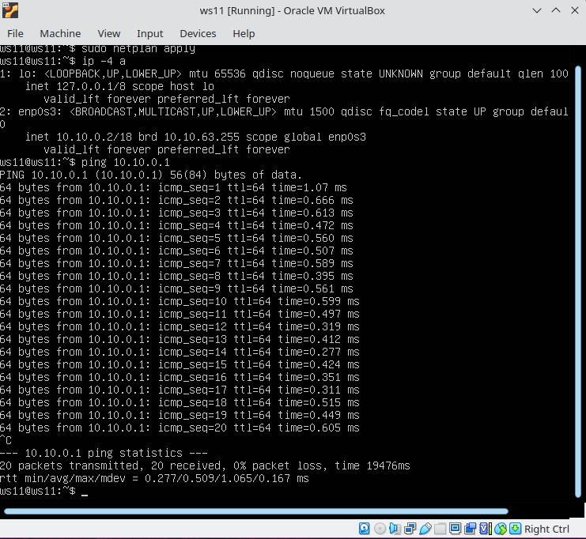

#### 5.2. Включение переадресации IP-адресов.
#### Для включения переадресации IP выполнила команду на роутерах:
`sysctl -w net.ipv4.ip_forward=1 (При таком подходе переадресация не будет работать после перезагрузки системы.)`

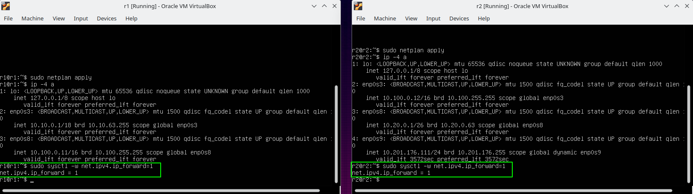
#### Открыла файл /etc/sysctl.conf и добавила в него следующую строку:
`net.ipv4.ip_forward = 1(При использовании этого подхода, IP-переадресация включена на постоянной основе.)`

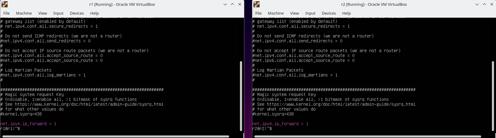

#### 5.3. Установка маршрута по умолчанию.
#### Настроила маршрут по умолчанию (шлюз) для рабочих станций. Для этого добавила default перед IP-роутера в файле конфигураций.
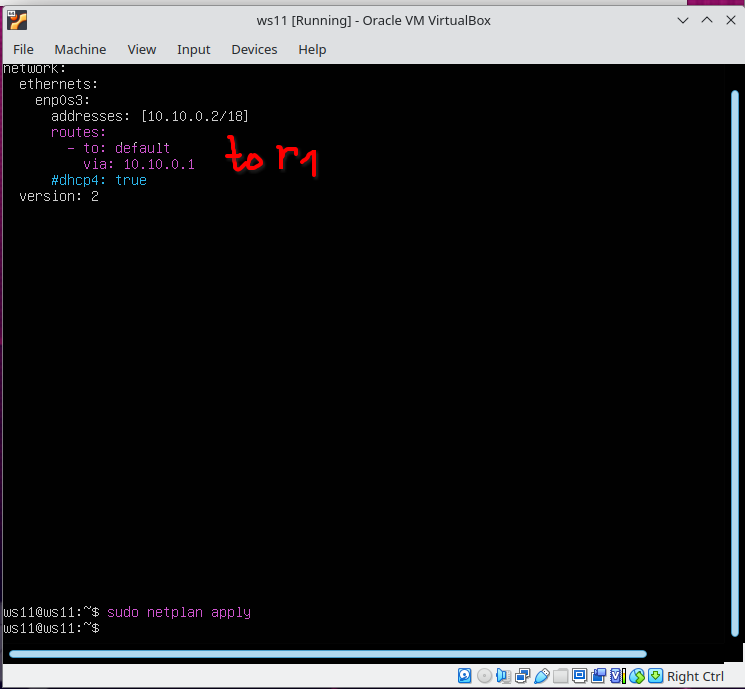

#### Вызвала ip r и показываю, что добавился маршрут в таблицу маршрутизации.
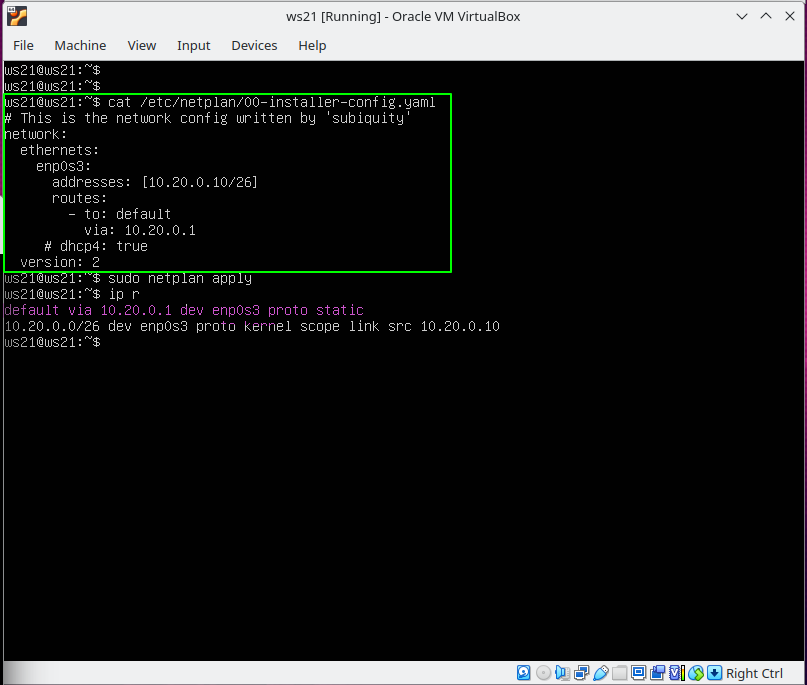
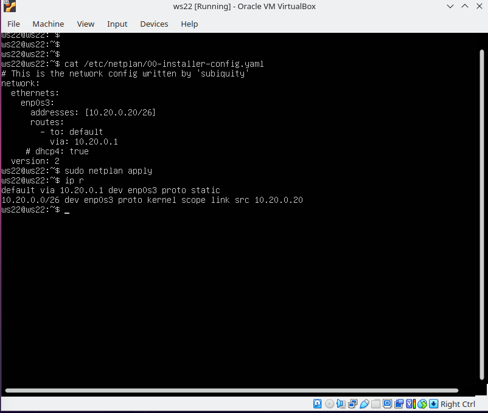
#### Пропинговала с ws11 роутер r2 и показываю на r2, что пинг доходит. Для этого использовала команду:
`tcpdump -tn -i eth0`

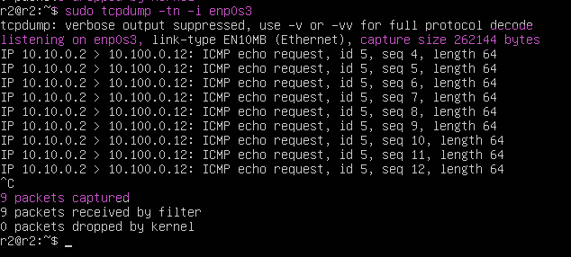

#### 5.4. Добавление статических маршрутов.
#### Добавила в роутеры r1 и r2 статические маршруты в файле конфигураций.
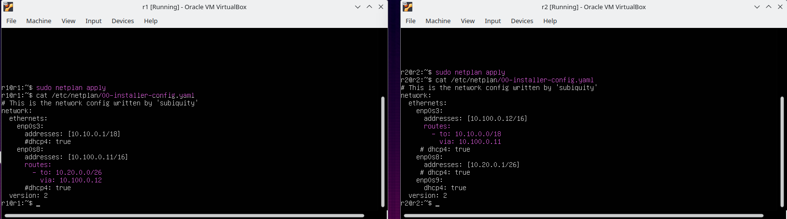
#### Вызвала ip r и показываю таблицы с маршрутами на обоих роутерах.

#### Запустилп команды ip r list на ws11:
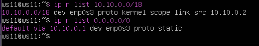

**Объяснение выбора маршрута на `ws11`:**

    Когда ws11 отправляет пакет, он использует принцип "наибольшего совпадения" (Longest Prefix Match) для выбора маршрута.
    Для пакета, предназначенного в локальную сеть `10.10.0.0/18`, система находит два возможных маршрута:

**Маршрут по умолчанию (`0.0.0.0/0`)** с длиной префикса `/0`.

**Маршрут в локальную сеть (`10.10.0.0/18`)** с длиной префикса `/18`.

    Система выбирает маршрут с самой длинной маской (в данном случае `/18`), так как он является более специфичным. Маршрут по умолчанию используется только для трафика, для которого не нашлось более точного маршрута.

#### 5.5 Построение списка маршрутизаторов
#### Запустила на r1 команду дампа: tcpdump -tnv -i eth0. При помощи утилиты traceroute построила список маршрутизаторов на пути от ws11 до ws21:
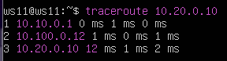

**В выводе traceroute будет показан список "прыжков" (hops) — IP-адресов маршрутизаторов, через которые прошёл пакет.:**

`Первый "прыжок" — это r1 (10.10.0.1).`
`Второй "прыжок" — это r2 (10.100.0.12).`
`Третий "прыжок" — это ws21 (10.20.0.10).`

**Объяснение принципа работы:**

`traceroute работает, отправляя UDP-пакеты с постоянно увеличивающимся значением TTL (Time to Live).`
`Первый пакет имеет TTL=1. Он достигает r1, r1 уменьшает TTL до 0 и отправляет ICMP-сообщение "Time to Live exceeded" обратно на ws11. ws11 записывает IP-адрес r1.`
`Второй пакет имеет TTL=2. Он проходит r1 (TTL=1), достигает r2, r2 уменьшает TTL до 0 и отправляет ICMP-сообщение обратно. ws11 записывает IP-адрес r2.`
`И так далее, пока пакет не достигнет ws21.`

#### 5.6. Использование протокола ICMP при маршрутизации.
#### Запустила на r1 перехват сетевого трафика, проходящего через eth0 с помощью команды: tcpdump -n -i eth0 icmp:
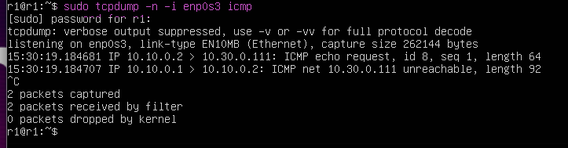
#### Пропинговала с ws11 несуществующий IP (например, 10.30.0.111) с помощью команды: ping -c 1 10.30.0.111 :
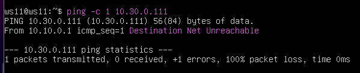

## Part 6. Динамическая настройка IP с помощью DHCP.
#### Для r2 настроила в файле /etc/dhcp/dhcpd.conf конфигурацию службы DHCP:
#### 1) Указала адрес маршрутизатора по умолчанию, DNS-сервер и адрес внутренней сети:

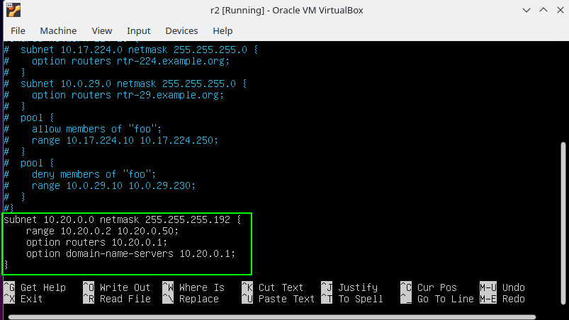
#### 2) В файле resolv.conf прописала nameserver 8.8.8.8:
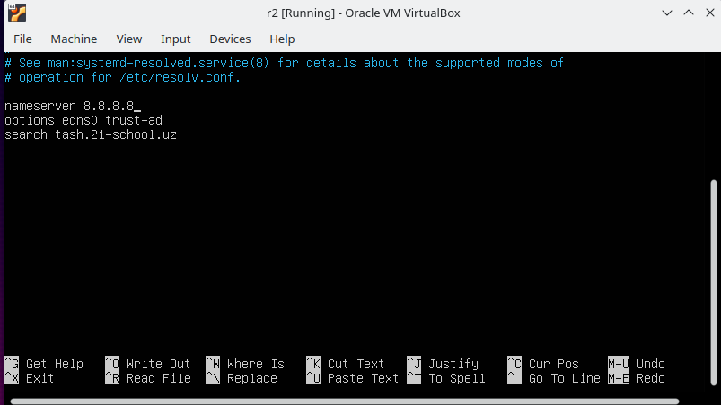
#### Перезагрузила службу DHCP командой systemctl restart isc-dhcp-server. Машину ws21 перезагрузила при помощи reboot и через ip a показала, что она получила адрес. Также пропинговала ws22 с ws21:
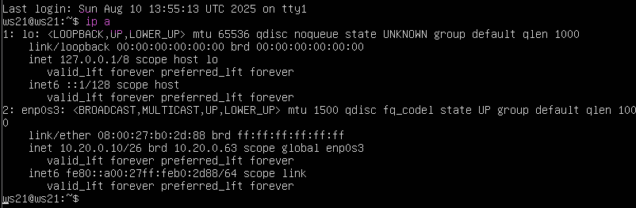
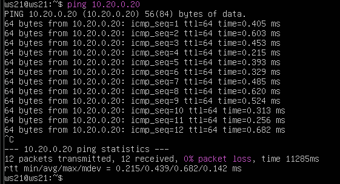
#### Указала MAC-адрес у ws11, для этого в etc/netplan/00-installer-config.yaml надо было добавить строки: macaddress: 10:10:10:10:10:BA, dhcp4: true :
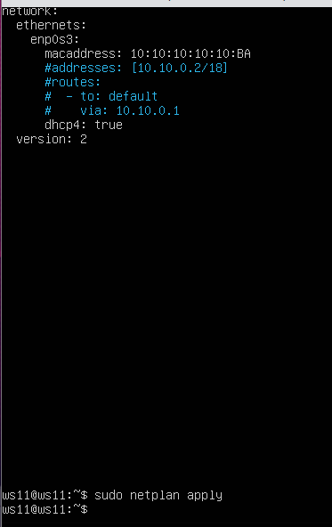
#### Для r1 настроила аналогично r2, но сделала согласно заданию, выдачу адресов с жесткой привязкой к MAC-адресу (ws11). Провела аналогичные тесты:
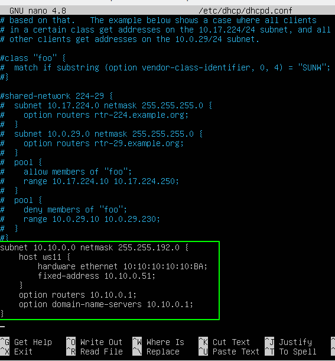

`option routers 10.10.0.1; — указывает, что шлюзом по умолчанию для клиентов этой сети будет 10.10.0.1.`
`option domain-name-servers 10.10.0.1; — указывает, что DNS-сервером будет 10.10.0.1.`

#### Запросила с ws21 обновление IP-адреса:
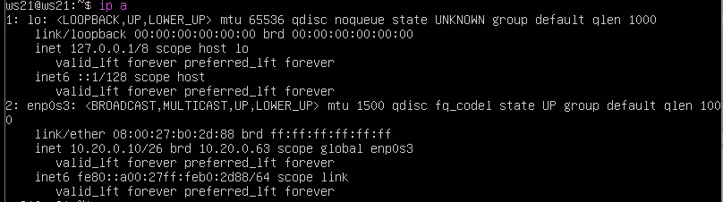
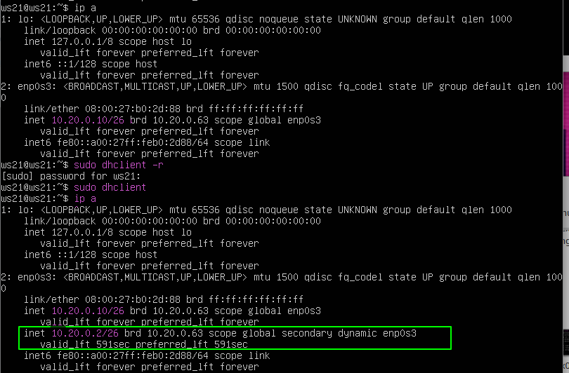

**В разделе Часть 6, включила следующее описание опций, которые я использовала:**

    subnet: Определяет подсеть, для которой будут применяться настройки DHCP.
    netmask: Задаёт маску подсети.
    range: Определяет диапазон IP-адресов, которые DHCP-сервер может выдавать динамически.
    option routers: Указывает клиентам адрес шлюза по умолчанию для выхода в другие сети.
    option domain-name-servers: Указывает клиентам адреса DNS-серверов для разрешения доменных имён.
    host: Используется для создания блока конфигурации для конкретного хоста.
    hardware ethernet: Определяет MAC-адрес сетевой карты клиента для жёсткой привязки.
    fixed-address: Устанавливает статический IP-адрес, который будет выдан клиенту с указанным MAC-адресом.

## Part 7. NAT.
#### В файле /etc/apache2/ports.conf на ws22 и r1 изменила строку Listen 80 на Listen 0.0.0.0:80, то есть сделала сервер Apache2 общедоступным.:
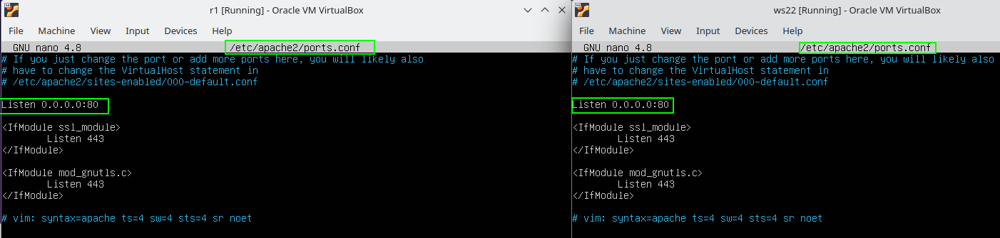
#### Запустила веб-сервер Apache командой service apache2 start на ws22 и r1:
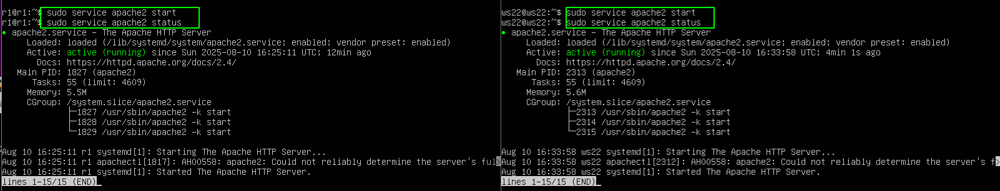
#### Добавила в фаервол, созданный по аналогии с фаерволом из Части 4, на r2 следующие правила:
    1) Удаление правил в таблице filter — iptables -F;
    2) Удаление правил в таблице «NAT» — iptables -F -t nat;
    3) Отбрасывать все маршрутизируемые пакеты — iptables --policy FORWARD DROP.
    Запустила файл также, как в Части 4.
    Проверила соединение между ws22 и r1 командой ping.:

#### При запуске файла с этими правилами, ws22 не должна «пинговаться» с r1.

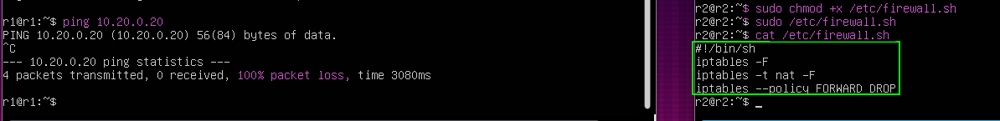
#### Добавила в файл ещё одно правило:
    4) Разрешила маршрутизацию всех пакетов протокола ICMP.
    Запустила файл также, как в Части 4.
#### Проверила соединение между ws22 и r1 командой ping.

`При запуске файла с этими правилами, ws22 должна «пинговаться» с r1.`

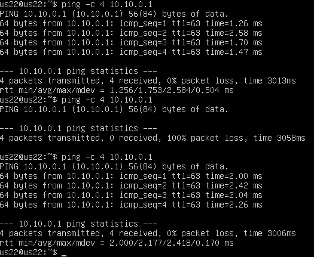

#### Добавила в файл ещё два правила:
    5) Включила SNAT, а именно маскирование всех локальных IPиз локальной сети, находящейся за r2 (по обозначениям из Части 5 — сеть 10.20.0.0).
    Совет из задания: стоит подумать о маршрутизации внутренних пакетов, а также внешних пакетов с установленным соединением.
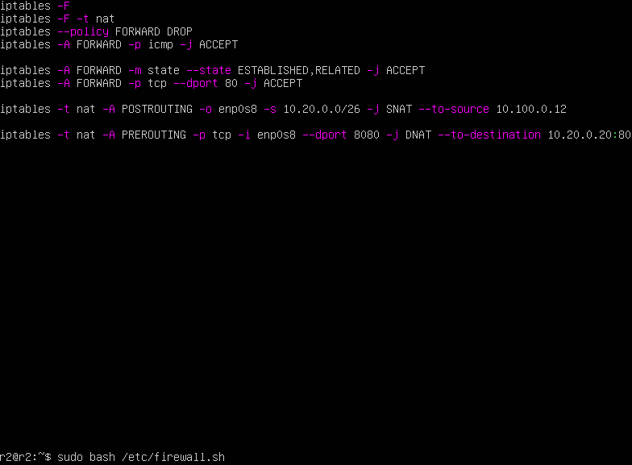
####
    6) Включила DNAT на 8080 порт машины r2 и добавила к веб-серверу Apache, запущенному на ws22, доступ извне сети.
    Совет из задания: стоит учесть, что при попытке подключения возникнет новое tcp-соединение, предназначенное ws22 и 80 порту.

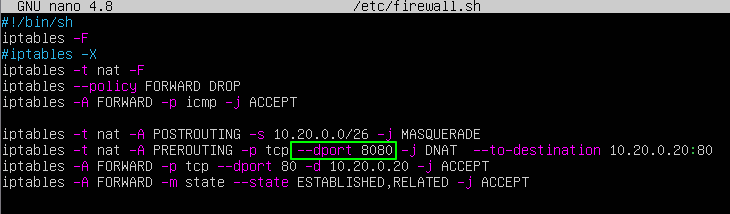
#### И наконец, я проверила соединение по TCP для SNAT: для этого с ws22 подключилась к серверу Apache на r1 командой:
`telnet 10.10.0.1 (порт=)80`

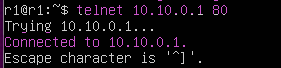
#### Проверила соединение по TCP для DNAT: для этого с r1 подключилась к серверу Apache на ws22 командой telnet (обратилась по адресу r2 и порту 8080):
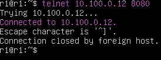

------------------------------------------
## Part 8. Дополнительно. Знакомство с SSH Tunnels.
#### Запустила на r2 фаервол с правилами из Части 7.
#### Запустила веб-сервер Apache на ws22 только на localhost (то есть в файле /etc/apache2/ports.conf изменила строку Listen 80 на Listen localhost:80).

#### Воспользовалась Local TCP forwarding с ws21 до ws22, чтобы получить доступ к веб-серверу на ws22 с ws21 и
#### воспользовалась Remote TCP forwarding c ws11 до ws22, чтобы получить доступ к веб-серверу на ws22 с ws11:
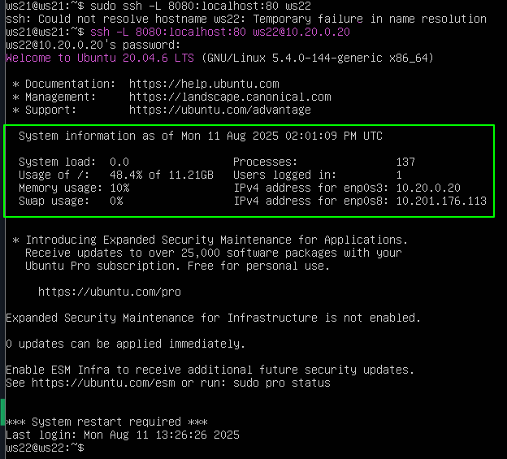
#### Для проверки, сработало ли подключение в обоих предыдущих пунктах, перешла во второй терминал (клавишами Alt + F2 или + F4) и выполнила  команду:
`telnet 127.0.0.1 (локальный порт)8080`

**Local TCP forwarding (-L): Туннель создается с локальной машины (ws21) на удалённую (ws22), позволяя получить доступ к сервису на удалённой машине через локальный порт.**
**Remote TCP forwarding (-R): Туннель создается с удалённой машины (r1) на локальную (r2), пробрасывая порт с локальной машины на удалённую, что позволяет другим машинам получить доступ к сервису.**

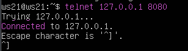
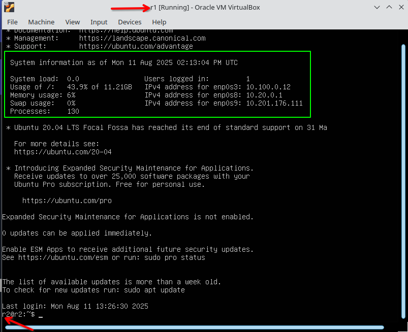

`Благодарю за внимание! rymundzu, 11.08.2025 💝`
