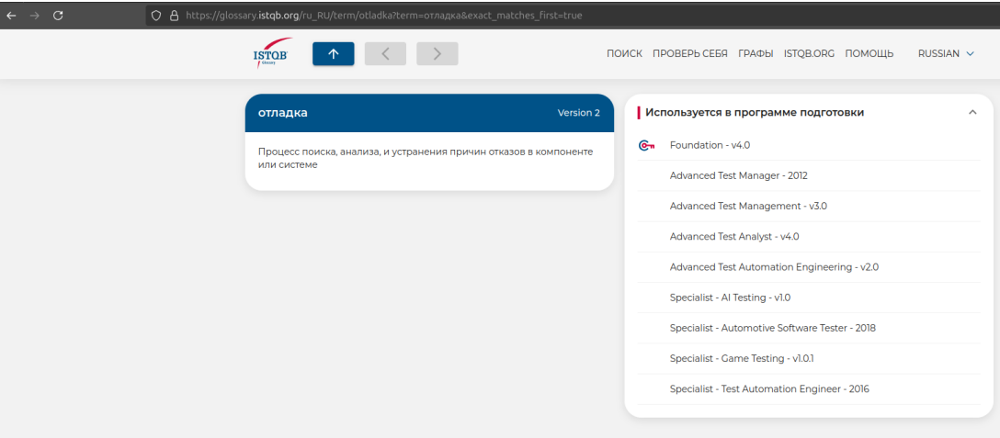

Ex. №1.

В разделе "Certifications" на официальном сайте ISTQB служит основным источником информаци о международных сертификациях в области тестирования программного обеспечания. Его основаня задача - предоставить пользователям полное и структурированное понятие о сущесвующих сертификационных программах, а также помочь специалистам и начинающим тестировщикам выбрать подходящий уровень и направление проффисионального развития.

Структура и содержание раздела. Раздел "Certifications" включает в себя следующие категории:

    1. Core Certification включает в себя стандартную иерархию сертификаций: foundation level (базовый уровень, для начинающих специалистов, охватывающий фундаментальные принципы тестирования программного обеспечения), advanced level (продвинутый уровень, для специалистов с опытом, содержит модули, ориентированные на различные роли в тестировании: Test Analyst, Technical Test Analyst, Test Manager), expert level (экспертный уровень, предназначен для высококварифицированных специалистов и лидеров команд, направлен на развитие стратегических и управленческих навыков в тестировании)

    2. Agile Certification включает в себя сертификации, направленные на применение практик тестирования в условиях гибких методологий разработки: Agile Tester Foundation Extension (базовый уровень, дополняющий Foundation Level, фокусируется на роли тестировщика в Agile-проектах), Advanced Agile Technical Tester (продвинутый уровень, направлен на глубокое понимание техник тестирования в гибких процессах разработки), Advanced Agile Test Leadership (продвинутый уровень, ориентирован на управление качеством и тестированием в Agile-среде, а также на лидерские функции в команде)

    3. Specialist Certifications предназначены для специалистов, желающих углубить знания в отдельных областях тестирования программного обеспечения: Test Automation Engineer (автоматизация тестирования, охватывает проектирование, реализацию и сопровождение автоматизированных тестов), Performance Tester (тестирование производительности, включает методы оценки скорости, масштабируемости и устойчивости приложений), Security Tester (тестирование безопасности, направлен на выявление уязвимостей и анализ рисков информационной безопасности), Mobile Application Tester (тестирование мобильных приложений, фокусируется на особенностях тестирования на мобильных устройствах и платформах), а также другие направления, охватывающие как технические аспекты, так и доменные области

SCR (Success Criteria Repository) — раздел, содержащий критерии успешного прохождения сертификаций ISTQB, включает в себя открытые вопросы, формулировки целей обучения и ожидания от кандидатов на экзаменах, предназначен для прозрачного понимания содержания экзаменов и требований к знаниям

Glossary — этто раздел, предоставляющий глоссарий терминов, используемых в области тестирования программного обеспечения, служит справочником для специалистов и кандидатов на сертификацию, помогает обеспечить единое понимание профессиональной терминологии на международном уровне

Значение слова отладка:

